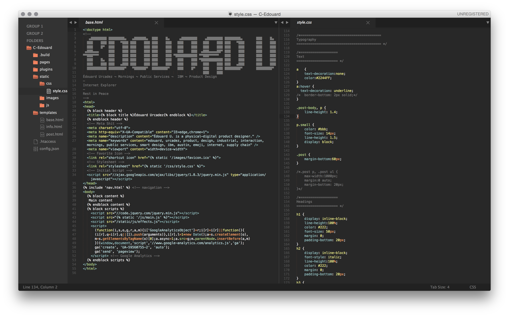

Sublime Text Preferences

—

As it stands:

I'm digging the [Predawn](https://github.com/jamiewilson/predawn) aesthetic at the moment, I might be using the highlighting coloration as well. Not putting too much thought into this stuff, since I'm trying to learn Vim. <:o)

—

Packages of note:

Nothing right now. Tabula Rasa.
